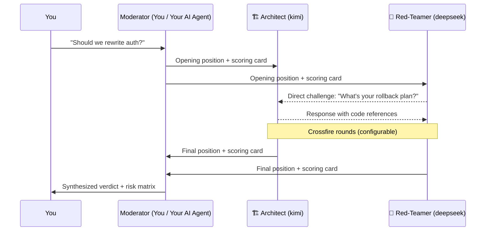

# model-roundtable

**Structured multi-model debate where an Architect and a Red-Teamer fight it out — and you get the verdict.**

> Not another "ask three models and pick the majority" tool.
> This one assigns adversarial personas, forces structured scoring, routes direct challenges between models, and lets you (or your AI agent) synthesize the final call.

---

## What happens when you run it

```
$ model-roundtable --topic "Should we split auth into a microservice?" --dry-run

Interactive roundtable run: ./roundtable-runs/interactive-20260727-103012
Meeting: irt-20260727-103012-a8f3c2d1
Profiles: kimi, deepseek
Cycles: 2; max directed turns: 12 (dry-run)

== opening ==
- kimi (opening)... ok          ← Architect proposes a plan
- deepseek (opening)... ok      ← Red-Teamer attacks it
- deepseek (opening-reply)... ok  ← Routed challenge response

== crossfire 1 ==
- kimi (crossfire-1)... ok      ← Architect defends with evidence
- deepseek (crossfire-1)... ok  ← Red-Teamer escalates

== crossfire 2 ==
- kimi (crossfire-2)... ok
- deepseek (crossfire-2)... ok

== final ==
- kimi (final)... ok            ← Final position + scoring card
- deepseek (final)... ok        ← Final position + scoring card

Transcript: ./roundtable-runs/.../interactive-transcript.md
```

Each model produces a **scoring card** — not just prose:

```json
{
  "scoring_card": {
    "architecture_extensibility": 8,
    "low_breaking_risk": 4,
    "implementation_ease": 6,
    "testability": 7
  },
  "confidence": "medium"
}
```

---

## How it works



**Key design choices:**

- **Adversarial by design.** The Architect builds. The Red-Teamer breaks. This tension is a feature, not a bug.
- **Scoring cards, not vibes.** Every model scores its proposal on extensibility, risk, ease, and testability (1–10). You compare numbers, not paragraphs.
- **Direct challenges.** Models can route pointed questions to each other. The controller enforces response limits so debates don't spiral.
- **Session persistence.** Each model keeps its memory across rounds (via Claude CLI `--session-id`). No repeated context loading.

---

## What this is NOT

- ❌ **Not model-agnostic.** Requires [Claude Code CLI](https://docs.anthropic.com/en/docs/claude-code) as the execution engine. Models are called through Anthropic-compatible API endpoints.
- ❌ **Not a consensus machine.** It surfaces disagreement, it doesn't suppress it.
- ❌ **Not a replacement for judgment.** It gives you structured evidence. You (or your AI moderator) make the call.
- ❌ **Not affiliated with Anthropic.** This is an independent, community-built tool.

---

## Prerequisites

1. **Node.js ≥ 18** — [nodejs.org](https://nodejs.org/)
2. **Claude Code CLI** — `npm install -g @anthropic-ai/claude-code && claude login`
3. **API profiles** — a JSON file telling the tool which models to call

Create `~/.claude/api-profiles.json` (copy from [`api-profiles.example.json`](./api-profiles.example.json)):

```json
{
  "kimi": {
    "description": "Kimi K3 — Architect persona",
    "model": "sonnet",
    "env": {
      "ANTHROPIC_BASE_URL": "https://api.kimi.com/coding/",
      "ANTHROPIC_API_KEY": "your-key-here"
    }
  },
  "deepseek": {
    "description": "DeepSeek V4 Pro — Red-Teamer persona",
    "model": "deepseek-v4-pro",
    "env": {
      "ANTHROPIC_BASE_URL": "https://api.deepseek.com/anthropic",
      "ANTHROPIC_AUTH_TOKEN": "your-token-here"
    }
  }
}
```

Verify everything is ready:

```bash
npx model-roundtable --preflight
```

---

## Quick Start

**Run your first debate:**

```bash
npx model-roundtable --topic "Should we use Redis caching or query optimization?"
```

**Dry run (no API calls, tests the full flow):**

```bash
npx model-roundtable --topic "Test topic" --dry-run
```

**Batch mode (V1 — fixed rounds, no direct messages, cheaper):**

```bash
npx model-roundtable --batch --topic "Compare ORM options" --rounds 3
```

**Let models read your codebase:**

```bash
npx model-roundtable --topic "Review our error handling" --allow-read-tools
```

---

## Options

| Flag | Default | Description |
| --- | --- | --- |
| `--topic "..."` | required | The question or decision to debate |
| `--topic-file path` | — | Read topic from a markdown file |
| `--profiles a,b` | `kimi,deepseek` | Comma-separated profile names |
| `--cycles N` | `2` | Crossfire rounds (V2 only) |
| `--rounds N` | `3` | Fixed rounds (V1/batch only) |
| `--max-directed-turns N` | `12` | Cap on routed direct messages |
| `--allow-read-tools` | off | Let models inspect workspace files (read-only) |
| `--allow-tools` | off | Let models use all tools (use with caution) |
| `--max-budget-usd N` | — | Per-model spend cap |
| `--dry-run` | off | Generate prompts and simulate without API calls |
| `--batch` | off | Use V1 batch mode instead of V2 interactive |
| `--preflight` | — | Check prerequisites and exit |

---

## Use as a Codex / Claude Code Skill

Clone into your skills directory:

```bash
git clone https://github.com/TCJ18086429778-hub/model-roundtable.git ~/.codex/skills/claude-roundtable
```

The included `SKILL.md` tells your AI agent **when and how** to trigger debates automatically — including when it detects you oscillating between choices or when your prompt contains conflicting constraints.

---

## Output

Every run produces a timestamped directory under `roundtable-runs/`:

```
roundtable-runs/interactive-20260727-103012/
├── state.json                    # Meeting metadata
├── messages.jsonl                # Every message (public + direct)
├── interactive-transcript.md     # Human-readable debate log
├── prompts/                      # Exact prompts sent to each model
├── responses/                    # Parsed model responses
└── raw/                          # Raw CLI output
```

---

## Security

- **Temporary credentials are destroyed on exit.** Per-model API settings are written to a temp directory with `0o600` permissions and deleted when the child process closes — or when the parent receives `SIGINT`/`SIGTERM`.
- **No keys in transcripts.** Token-like values are redacted from all metadata and logs.
- **Path traversal protection.** `--workspace`, `--out`, and `--topic-file` are validated against the working directory.
- **No global config mutation.** Your `~/.claude/settings.json` is never touched.

---

## FAQ

**Q: Why route through Claude CLI instead of calling APIs directly?**
A: Claude CLI handles session persistence, tool sandboxing, spend caps, and output formatting. Reimplementing all of that would be a separate project. The tradeoff is an extra dependency.

**Q: Can I add GPT, Gemini, or local models?**
A: Yes. Add any model that exposes an Anthropic-compatible Messages API endpoint to your `api-profiles.json`. Many providers and proxies support this format.

**Q: Is my API key safe?**
A: Keys are written to a per-call temp file (not the global config), restricted to owner-read (`0o600`), and deleted immediately after use. They never appear in prompts, transcripts, or logs.

**Q: What if one model is clearly weaker?**
A: That's fine — and useful. The scoring cards make the quality gap visible. A weak model often still catches edge cases the strong model missed.

---

## 中文说明

**model-roundtable** 是一个结构化的多模型辩论工具。它为参与讨论的 AI 模型分配**对抗性角色**（架构师 vs 红队攻防手），要求每个模型给出 **1-10 分的量化评分卡**，支持模型之间的**定向质问与反驳**，最终由主控 Agent 综合裁决。

### 核心特点
- 🏗️ **架构师 vs 🔴 红队**：不是简单的"多问几个模型"，而是制造有价值的思想碰撞
- 📊 **结构化打分卡**：架构扩展性、破坏性风险、实施难度、可测试性（1-10 分）
- 💬 **模型间定向质问**：模型可以直接向对方发起挑战并要求回应
- 🔒 **安全隔离**：临时 API 凭证即时销毁，路径穿越防护，日志自动脱敏

### 快速开始

```bash
# 检查前置依赖
npx model-roundtable --preflight

# 运行第一场辩论
npx model-roundtable --topic "微服务 vs 单体架构"

# 允许模型只读检索代码库
npx model-roundtable --topic "审查错误处理方案" --allow-read-tools
```

详细配置请参阅上方英文文档。

---

## License

[MIT](./LICENSE)

> **Disclaimer:** This project is not affiliated with, endorsed by, or sponsored by Anthropic. "Claude" is a trademark of Anthropic, PBC.
